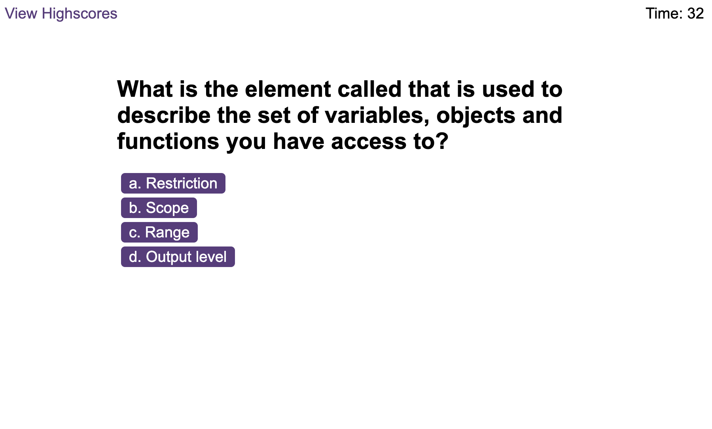
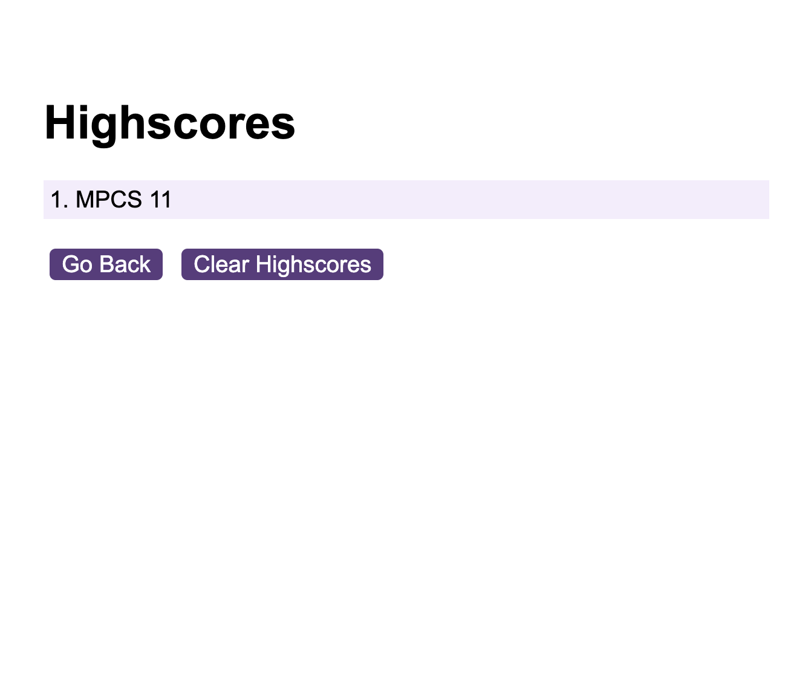

# Coding-quiz

## Description
The Javascript coding quiz is a browser-based application that presents a timed quiz to users with multiple-choice questions related to programming concepts. The user interface is clean, polished, and responsive, and is powered by JavaScript code that dynamically updates the HTML and CSS. The quiz is designed to test the user's knowledge of coding and programming, and is an excellent way to assess their skills.


## User Story

```
AS A coding boot camp student
I WANT to take a timed quiz on JavaScript fundamentals that stores high scores
SO THAT I can gauge my progress compared to my peers
```

  
## Links and Screenshots 

Screenshot of application:  

Screenshot of Highscores: 

You can find the webpage [here](https://marianapcs.github.io/coding-quiz/)


## Acknowledgements
Would not have been able to complete this challenge without the help of everyone in my course nor without the major help of Google, W3Schools and mdn web docs and my project Group - *Josh is a star*. God Bless the Internet!